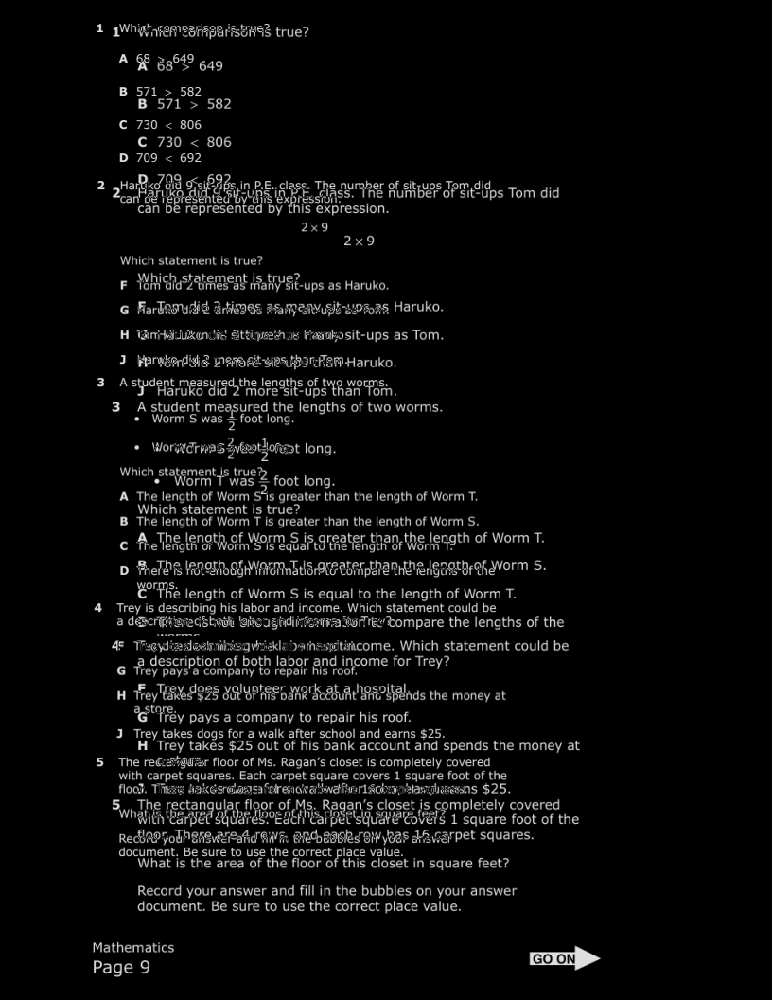
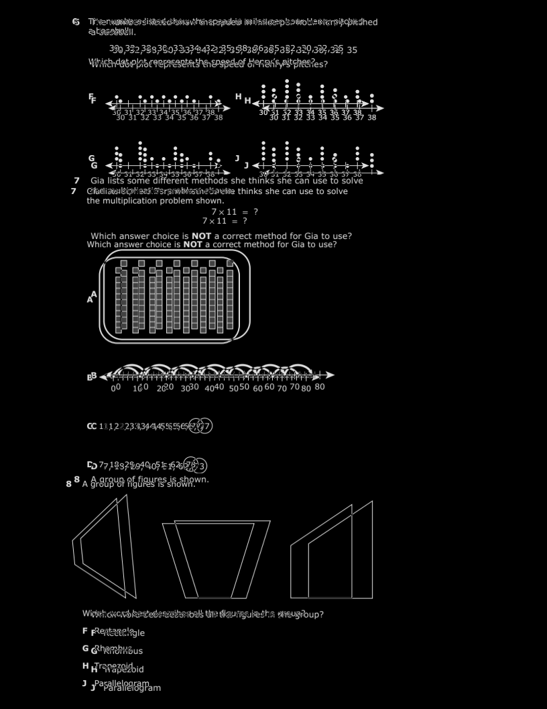
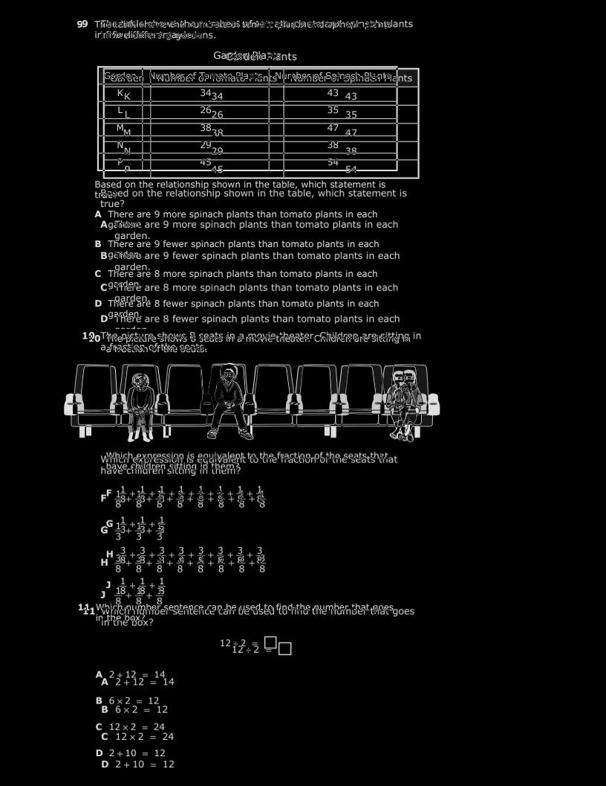
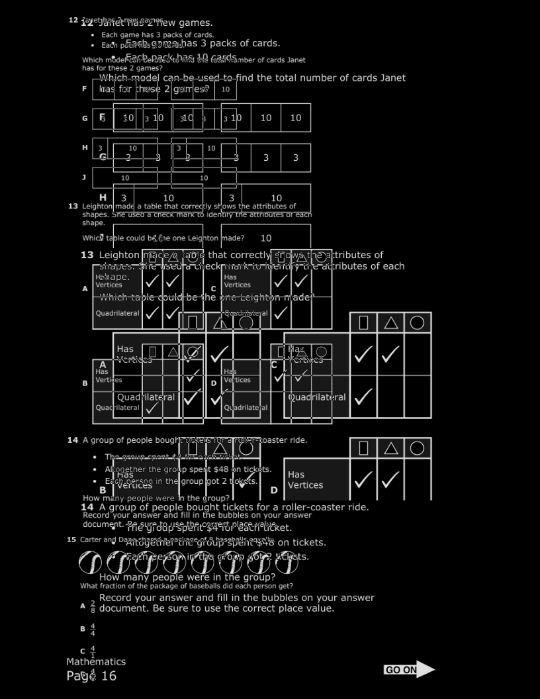
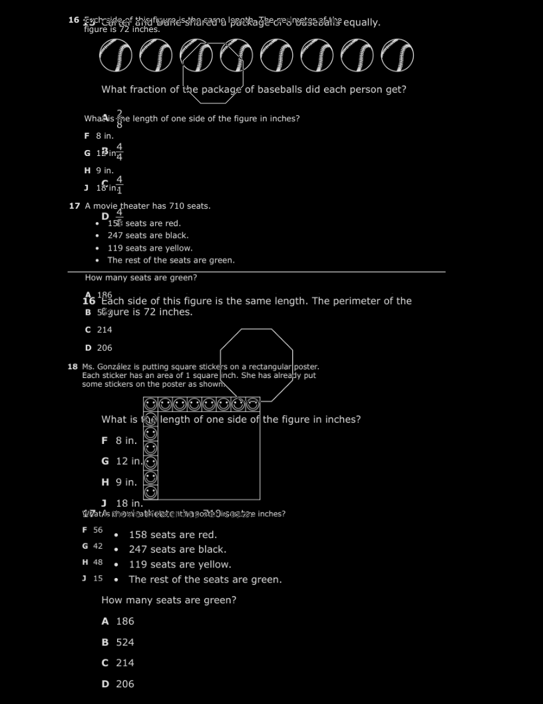
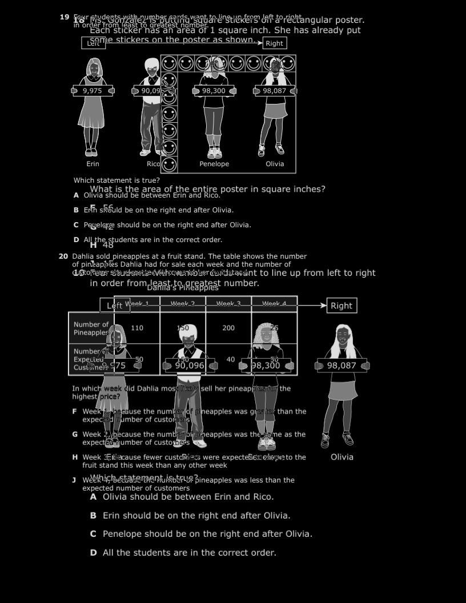
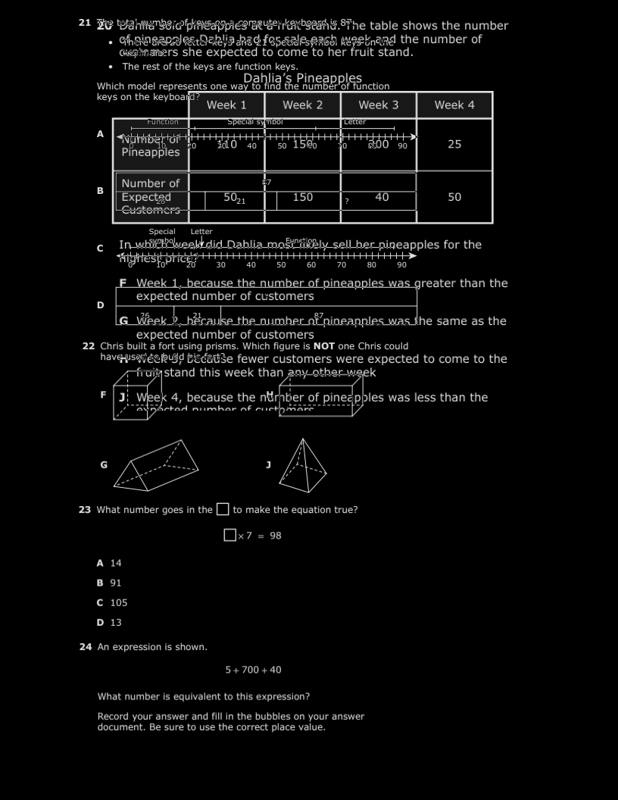
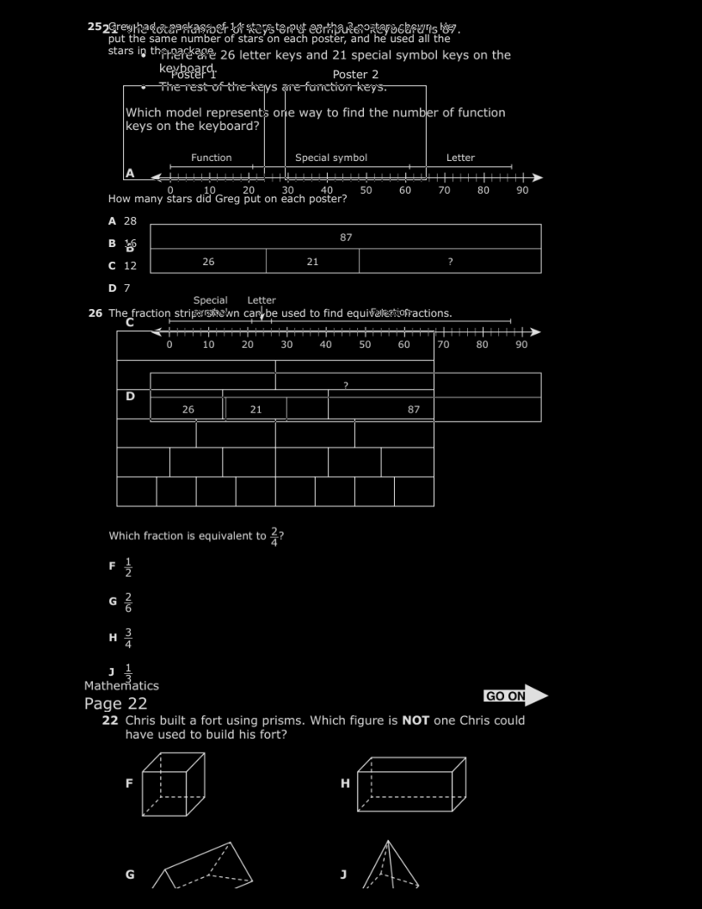
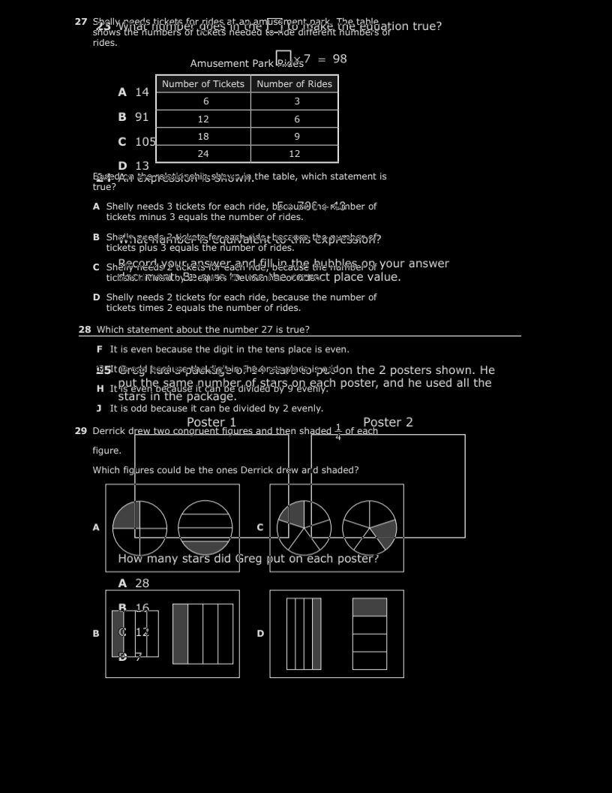
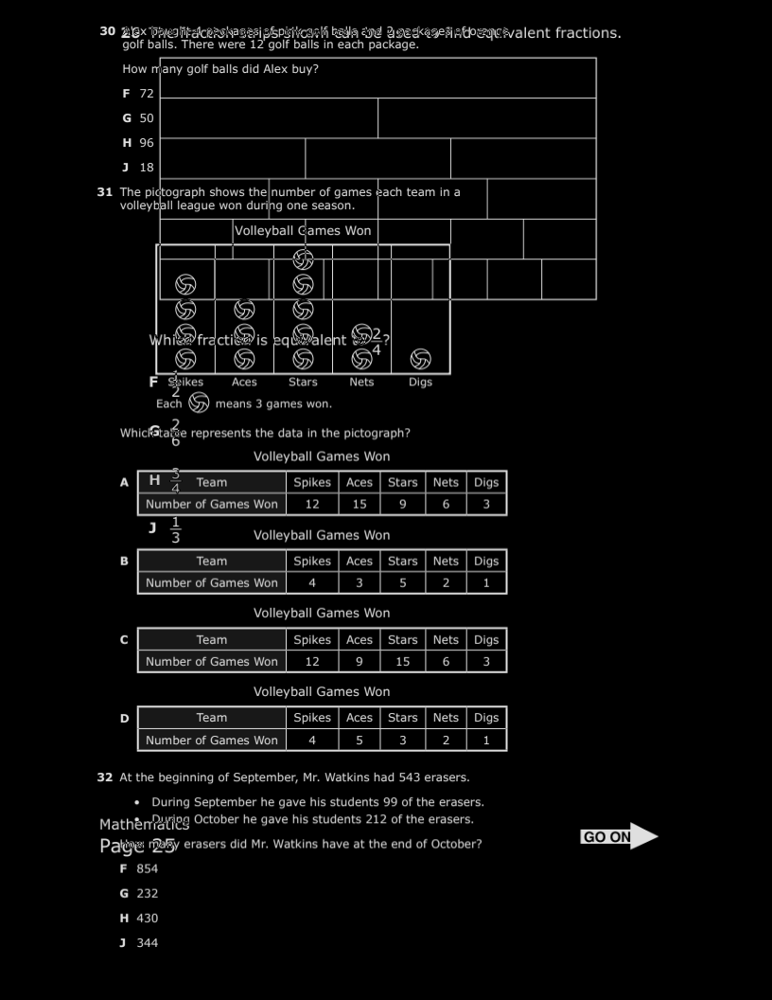

# Defect Report — 2022-staar-3-math-test_Compacted_1col_20260427_053606

| | |
|---|---|
| **Golden** | `2022-staar-3-math-test-golden-sample.pdf` (10 pages) |
| **Output** | `2022-staar-3-math-test_Compacted_1col_20260427_053606.pdf` (12 pages) |
| **Total defects** | 13 |

| ID | Page | Type | Severity | Priority | Description |
|---|---|---|---|---|---|
| DEF-001 | — | `page_count_mismatch` | **High** | P2 | Output has 2 more page(s) than the golden sample (12 vs 10). This indicates blocks were split differently or extra/missing content pages were produced. |
| DEF-002 | 1 | `visual_diff` | **Medium** | P3 | Moderate visual difference on this page — 9.5% of pixels differ. Minor layout shift or scaling variance detected. |
| DEF-003 | 2 | `visual_diff` | **Medium** | P3 | Moderate visual difference on this page — 7.6% of pixels differ. Minor layout shift or scaling variance detected. |
| DEF-004 | 3 | `visual_diff` | **Medium** | P3 | Moderate visual difference on this page — 9.2% of pixels differ. Minor layout shift or scaling variance detected. |
| DEF-005 | 4 | `visual_diff` | **High** | P2 | Significant visual difference on this page — 11.1% of pixels differ. Question blocks, spacing, or images likely misaligned relative to the golden. |
| DEF-006 | 5 | `visual_diff` | **Medium** | P3 | Moderate visual difference on this page — 5.3% of pixels differ. Minor layout shift or scaling variance detected. |
| DEF-007 | 6 | `visual_diff` | **High** | P2 | Significant visual difference on this page — 12.7% of pixels differ. Question blocks, spacing, or images likely misaligned relative to the golden. |
| DEF-008 | 7 | `visual_diff` | **Medium** | P3 | Moderate visual difference on this page — 8.0% of pixels differ. Minor layout shift or scaling variance detected. |
| DEF-009 | 8 | `visual_diff` | **Medium** | P3 | Moderate visual difference on this page — 5.5% of pixels differ. Minor layout shift or scaling variance detected. |
| DEF-010 | 9 | `visual_diff` | **Medium** | P3 | Moderate visual difference on this page — 8.3% of pixels differ. Minor layout shift or scaling variance detected. |
| DEF-011 | 10 | `visual_diff` | **Medium** | P3 | Moderate visual difference on this page — 7.9% of pixels differ. Minor layout shift or scaling variance detected. |
| DEF-012 | 11 | `extra_output_page` | **High** | P2 | Output contains an extra page (page 11) not present in the golden sample. Page appears to be entirely blank — likely a packing overflow. |
| DEF-013 | 12 | `extra_output_page` | **High** | P2 | Output contains an extra page (page 12) not present in the golden sample. Page is 38.0% blank — partial overflow or orphaned block. |

---

## Diff Images

### DEF-002 — Page 1 (Medium / P3)

_Moderate visual difference on this page — 9.5% of pixels differ. Minor layout shift or scaling variance detected._

### DEF-003 — Page 2 (Medium / P3)

_Moderate visual difference on this page — 7.6% of pixels differ. Minor layout shift or scaling variance detected._

### DEF-004 — Page 3 (Medium / P3)

_Moderate visual difference on this page — 9.2% of pixels differ. Minor layout shift or scaling variance detected._

### DEF-005 — Page 4 (High / P2)

_Significant visual difference on this page — 11.1% of pixels differ. Question blocks, spacing, or images likely misaligned relative to the golden._

### DEF-006 — Page 5 (Medium / P3)

_Moderate visual difference on this page — 5.3% of pixels differ. Minor layout shift or scaling variance detected._

### DEF-007 — Page 6 (High / P2)

_Significant visual difference on this page — 12.7% of pixels differ. Question blocks, spacing, or images likely misaligned relative to the golden._

### DEF-008 — Page 7 (Medium / P3)

_Moderate visual difference on this page — 8.0% of pixels differ. Minor layout shift or scaling variance detected._

### DEF-009 — Page 8 (Medium / P3)

_Moderate visual difference on this page — 5.5% of pixels differ. Minor layout shift or scaling variance detected._

### DEF-010 — Page 9 (Medium / P3)

_Moderate visual difference on this page — 8.3% of pixels differ. Minor layout shift or scaling variance detected._

### DEF-011 — Page 10 (Medium / P3)

_Moderate visual difference on this page — 7.9% of pixels differ. Minor layout shift or scaling variance detected._

