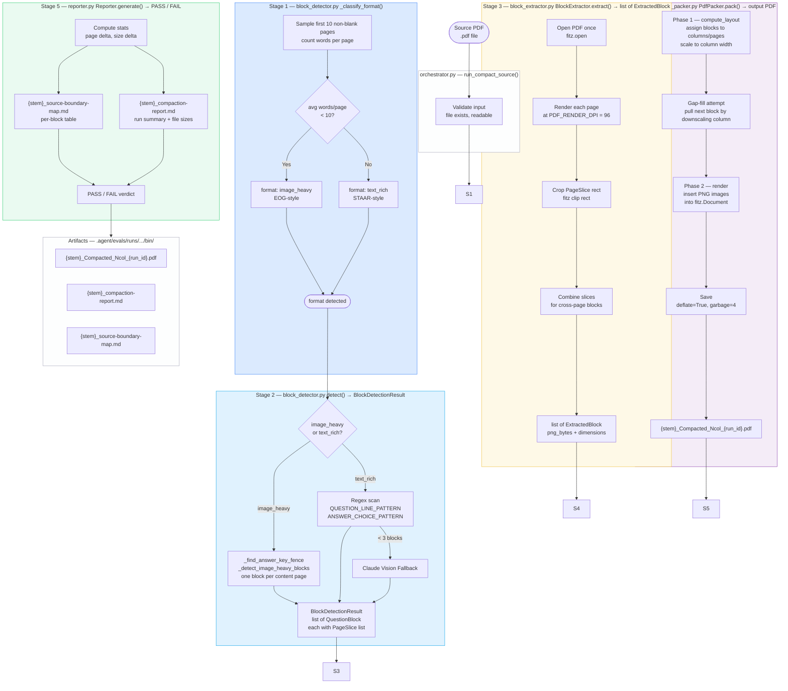
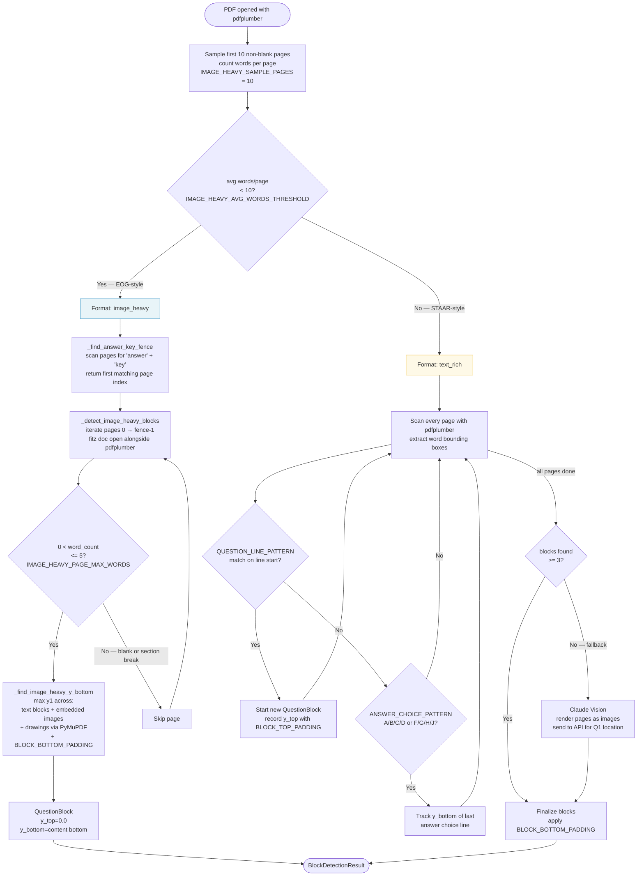
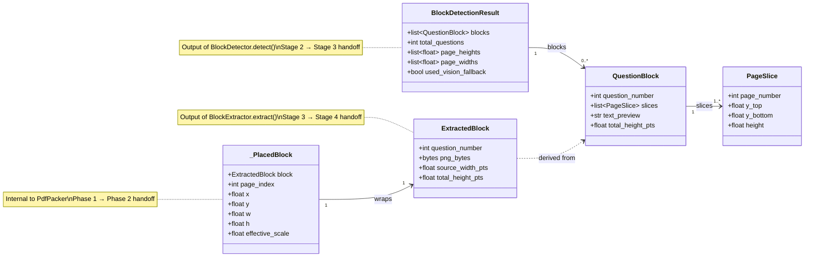
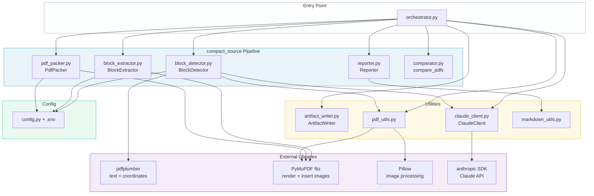

# compact_source — Design

**Feature:** `compact_source`
**Version:** v1
**Status:** Active
**Date:** 2026-04-26
**Spec:** [compact_source-spec.md](compact_source-spec.md)
**PRD:** [compact_source-prd.md](compact_source-prd.md)

This document is the living implementation record for `compact_source`. It covers system architecture (§1–§5) and a phase delivery log (§6) that grows as each phase completes. Platform-level concerns (observability, resilience, quality, self-improvement) live in [../platform/](../platform/README.md) — this document references them but does not repeat them.

---

## 1. End-to-End Pipeline

Five stages. Stages 1 and 2 both live in `block_detector.py` — format detection feeds directly into block detection within the same `detect()` call.



---

## 2. Stage 1–2 — Format Detection & Block Detection Logic



---

## 2a. Shared Utility — `src/utils/image_utils.py`

This module provides pixel-level blank-row analysis for block images. It is shared between `block_extractor.py` (trim blank rows during crop) and `reporter.py` (measure whitespace efficiency for reporting).

### Key functions

| Function | Purpose |
|----------|---------|
| `count_bottom_blank_rows(png_bytes)` | Decode PNG bytes via `fitz.Pixmap`, delegate to `_count_blank_rows_from_pixmap`. Used when only bytes are available. |
| `blank_bottom_fraction(png_bytes)` | Return `blank_rows / total_height` as a float in `[0, max_fraction]`. Retained for image_utils pixel-level analysis. |
| `count_bottom_blank_rows_from_pixmap(pixmap)` | Caller already holds a `fitz.Pixmap` (block_extractor pixel-trimmer). Avoids re-decode. |
| `_count_blank_rows_from_pixmap(pm, threshold, max_fraction)` | Core loop: walks rows from bottom; stops when a non-near-white pixel is found or `max_fraction` rows scanned. |

**Blank pixel definition**: all RGB channels ≥ `threshold` (default 245).

**`max_fraction` cap** (default 0.5): prevents classifying a legitimately sparse page as fully blank.

### Block Height Efficiency Check Stage (reporter.py `_build_whitespace_section`)

After all blocks are extracted, `reporter.py` iterates each `ExtractedBlock` and measures `total_height_pts / page_height`. Any block ≥ `IMAGE_HEAVY_HEIGHT_WARN_FRACTION` (default 95%) is flagged with `⚠ OVERSIZED`. If any blocks are flagged the overall report verdict is FAIL.

This check runs on **post-extractor heights** (after the pixel-trimmer has removed blank rows), so it accurately reflects what was actually packed into the output PDF. A regression back to the pre-fix `y_bottom = page_height` would cause all blocks to report near-100% height and fail the check.

**Why 95% and not a lower threshold:** EOG question content legitimately fills between 46% and 93.5% of the page (large diagram questions fill most of the available space above the footer). A threshold below 95% would produce false positives.

---

## 3. Stage 4 — PdfPacker Layout Algorithm

```mermaid
flowchart TD
    A([list of ExtractedBlock\npng_bytes + source dimensions]) --> P1

    subgraph PHASE1["Phase 1 — compute_layout()"]
        P1[For each block\ncompute base_scale\nto fill column width] --> P2
        P2[Will block fit\nin remaining column space?]
        P2 -->|Yes| P3[Place block\nadvance y cursor]
        P2 -->|No| P4[Gap-fill attempt\nleftover > GAP_THRESHOLD_PTS?]
        P4 -->|Yes — try to pull next block| P5[Can all column blocks\ndownscale ≤ MAX_SCALE_REDUCTION\nto fit next block?]
        P5 -->|Yes| P6[Re-layout column\nwith extra block]
        P5 -->|No| P7[Advance column\nor start new page]
        P4 -->|No gap worth filling| P7
        P3 --> P8{More blocks?}
        P6 --> P8
        P7 --> P8
        P8 -->|Yes| P2
        P8 -->|No| P9[list of _PlacedBlock\npage_index, x, y, w, h\neffective_scale per block]
    end

    P9 --> R1

    subgraph PHASE2["Phase 2 — render()"]
        R1[Create fitz.Document\nadd blank pages] --> R2
        R2[For each _PlacedBlock\ninsert PNG at computed rect] --> R2a
        R2a{add_question_numbers?}
        R2a -->|Yes| R2b[draw white bg rect\ninsert_text label\n'N.' at top-left\noverlay=True]
        R2a -->|No| R3
        R2b --> R3
        R3[doc.save\ndeflate=True\ngarbage=4]
    end

    R3 --> NOTE1
    NOTE1["`question_start` shifts sequence\n`--no-question-numbers` suppresses\nauto-enabled for is_image_heavy"]

    R3 --> OUT([Output PDF\noutput_page_count])

    subgraph LAYOUT["Layout Parameters"]
        L1["Page: 8.5 × 11 in · 612 × 792 pts\nMargin: OUTPUT_PAGE_MARGIN_PTS\nColumn gap: COLUMN_GAP_PTS\nColumns: 1 or 2"]
    end

    style PHASE1 fill:#f4ecf7,stroke:#8e44ad
    style PHASE2 fill:#eafaf1,stroke:#2ecc71
    style LAYOUT fill:#fdfefe,stroke:#aab
```

---

## 4. Data Model & Stage Handoffs



---

## 5. Module Dependency Map



---

## 6. Phase Delivery Log

Each phase that touches `compact_source` adds a section here. Platform-level design (schemas, class structure, logging wiring) stays in `platform/` — only what is compact_source-specific is recorded below.

---

### 6.1 Phase 2 — Observability

**Backlog:** IMP-003, IMP-004
**Status:** Designed — pending implementation
**Platform docs:** [observability spec](../platform/observability/platform-observability-spec.md) · [observability design](../platform/observability/platform-observability-design.md)

#### Modules changed

| Module | Change |
|--------|--------|
| `src/orchestrator.py` | Wrap each stage with `time.perf_counter()`; populate and save `RunTelemetry`; write `batch-telemetry.json` in folder mode; replace all `print()` |
| `src/compact_source/block_detector.py` | Replace `print()` → `logger.debug/info/warning` |
| `src/compact_source/block_extractor.py` | Replace `print()` → `logger.debug/info` |
| `src/compact_source/pdf_packer.py` | Replace `print()` → `logger.debug/info` |
| `src/compact_source/reporter.py` | Replace `print()` → `logger.debug/info` |

No public signatures change. No callers break.

#### Defect codes

| Code | Stage | Severity | Trigger |
|------|-------|----------|---------|
| `VISION_FALLBACK_USED` | `block_detection` | `warning` | Text scan found < 3 blocks; Claude vision activated |
| `ZERO_BLOCKS_DETECTED` | `block_detection` | `error` | No question blocks found after all detection paths |
| `ANSWER_KEY_FENCE_NOT_FOUND` | `block_detection` | `info` | No answer key page found; all pages included |
| `OUTPUT_LARGER_THAN_SOURCE` | `reporting` | `info` | Output PDF is larger than source file |

#### Acceptance criteria (compact_source-specific)

Full platform AC: TC-OBS-01 through TC-OBS-12 in the platform spec.

| ID | Criterion |
|----|-----------|
| AC-CS-01 | `stages.format_detection.format_detected` is `"image_heavy"` for a known EOG PDF |
| AC-CS-02 | `stages.block_detection.blocks_detected` matches golden counts (gr_3=40, gr_4=50, gr_5=50) |
| AC-CS-03 | `defects` contains `VISION_FALLBACK_USED` when vision fallback was activated |
| AC-CS-04 | `summary.pages_saved` equals source page count minus output page count |
| AC-CS-05 | `batch-telemetry.json.runs` has one entry per PDF in the folder |

#### Open questions

| # | Question | Owner | Status |
|---|----------|-------|--------|
| Q1 | Should `format_detection` timing be separate from `block_detection`, or lumped together? | Tech | Start lumped; split if evaluator needs per-stage granularity |

---

### 6.2 Phase 3 — Resilience

**Backlog:** IMP-005, IMP-006, IMP-007
**Status:** Planned
**Platform docs:** [resilience spec](../platform/resilience/platform-resilience-spec.md)

*To be filled when Phase 3 begins.*

---

### 6.3 Phase 4 — Quality

**Backlog:** IMP-002, IMP-008, IMP-009
**Status:** Planned
**Platform docs:** [quality spec](../platform/quality/platform-quality-spec.md)

*To be filled when Phase 4 begins.*

---

### 6.4 Phase 5 — Self-Improvement

**Backlog:** IMP-010, IMP-011, IMP-012
**Status:** Planned
**Platform docs:** [self-improvement spec](../platform/self-improvement/platform-self-improvement-spec.md)

*To be filled when Phase 5 begins.*
