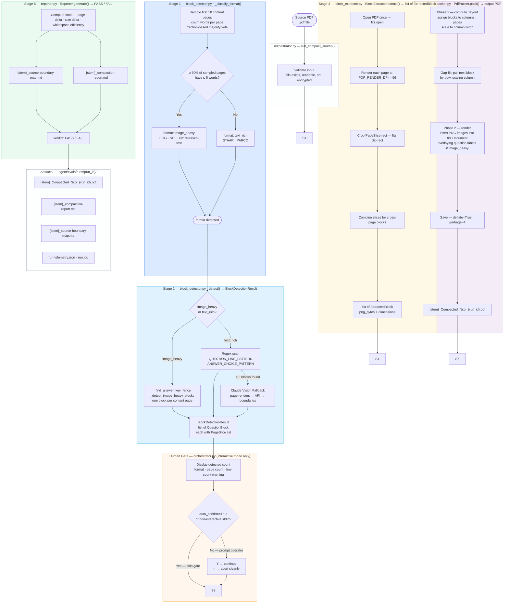
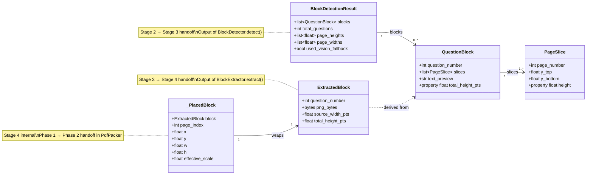
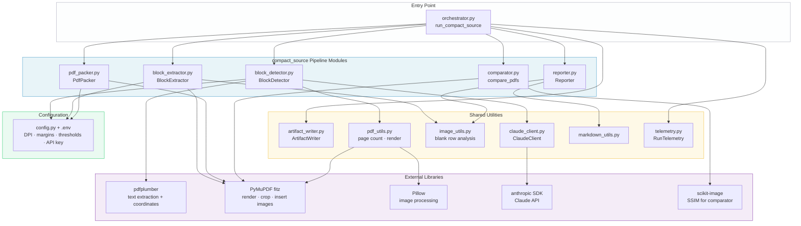

# compact_source — High-Level Design (System Design)

**Feature:** `compact_source`
**Document Type:** HLD — System Design · Holistic Architecture
**Version:** v1
**Status:** Active
**Date:** 2026-05-10
**Authority:** Governed by `compact_source-spec.md`; intent defined in `compact_source-prd.md`

> **Detailed algorithms, per-stage contracts, constants, and implementation specifics →** see `compact_source-lld.md`

---

## 1. Architectural Philosophy

`compact_source` is built on one inviolable constraint:

```
Pixel-exact preservation of source content.
No text extraction. No re-rendering. No OCR.
```

This constraint exists because math exam content — formulas, coordinate planes, geometric figures, answer-choice fonts — cannot be faithfully reproduced by any text-based pipeline. The only safe transformation is a visual one: crop the content regions as pixel images and repack them into a denser layout.

Every design decision in this system is a consequence of this constraint.

| Traditional PDF tools | compact_source |
|-----------------------|---------------|
| Extract text, reflow | Rasterize page regions, preserve as PNG |
| Re-render with a layout engine | Pack pixel images using only arithmetic |
| May alter math symbols | Never touches source content |
| Fast on text PDFs | Correct on all exam formats |

---

## 2. End-to-End Pipeline



---

## 3. Data Model & Stage Handoffs

Each stage produces a well-typed artifact consumed by the next. No stage bypasses these contracts.



---

## 4. Module Dependency Map



---

## 5. Holistic Platform Impacts

`compact_source` is not an isolated script. It is a feature in a platform-governed system. Each platform capability below has a defined phase, a backlog entry, and a spec or design document.

```mermaid
flowchart LR
    subgraph CS["compact_source Pipeline"]
        direction TB
        S1[Stage 1\nFormat Detection]
        S2[Stage 2\nBlock Detection]
        S3[Stage 3\nExtraction]
        S4[Stage 4\nPacking]
        S5[Stage 5\nReporting]
    end

    subgraph P2["Phase 2 — Observability 🔲"]
        TL2[run-telemetry.json\nper-stage timing · defect codes]
        LOG[run.log\nstructured logging via logging module]
    end

    subgraph P3["Phase 3 — Resilience 🔲"]
        VAL[validate_input()\nfails fast before pipeline]
        EXC[exceptions.py\ntyped exception hierarchy]
        RET[ClaudeClient backoff\nexponential retry + jitter]
    end

    subgraph P4["Phase 4 — Quality 🔲"]
        TST[pytest suite\nunit + integration tests]
        EVL[evaluator.py\n5-dimension scoring]
        GTE[quality gate\nblock PASS below threshold]
    end

    subgraph P5["Phase 5 — Self-Improvement 🔲"]
        GLD[golden file registry\nauto-comparator per run]
        LRN[learnings extractor\nclassify failures → learnings.md]
        HLG[self-healing engine\nrepair playbook · auto-retry]
    end

    CS --> P2
    CS --> P3
    CS --> P4
    CS --> P5

    style CS fill:#e8f4f8,stroke:#4a9eca
    style P2 fill:#fef9e7,stroke:#f0c040
    style P3 fill:#fff7ed,stroke:#f59e0b
    style P4 fill:#f4ecf7,stroke:#8e44ad
    style P5 fill:#eafaf1,stroke:#2ecc71
```

| Phase | Backlog Items | Platform Spec | Status |
|-------|--------------|---------------|--------|
| Phase 2 — Observability | CS-003, CS-004 | `platform/observability/platform-observability-spec.md` | 🔲 Planned |
| Phase 3 — Resilience | CS-005, CS-006, CS-007 | `platform/resilience/platform-resilience-spec.md` | 🔲 Planned |
| Phase 4 — Quality | CS-002, CS-008, CS-009 | `platform/quality/platform-quality-spec.md` | 🔲 Planned |
| Phase 5 — Self-Improvement | CS-010, CS-011, CS-012 | `platform/self-improvement/platform-self-improvement-spec.md` | 🔲 Planned |

> Backlog items CS-001 through CS-012 are tracked in `.agent/specs/compact_source/compact_source-backlog.md`.

---

## 6. Key Architectural Decisions

| # | Decision | Rationale |
|---|----------|-----------|
| D-HLD-01 | **Rasterize, do not extract text** | Math symbols, coordinate planes, and geometric figures have no reliable text representation. Pixel-exact crop is the only correct strategy. |
| D-HLD-02 | **Fraction-based format classification, not average word count** | PDFs with word-rich cover pages followed by image-heavy question pages caused misclassification under average-based thresholds (BUG-005). A per-page majority vote is robust to mixed-content pages at the start of a document. |
| D-HLD-03 | **Human gate after block detection, before extraction** | A wrong block set produces a defective output PDF that wastes print runs and reaches teachers. A 5-second human confirmation is cheaper than a re-run. Gate can be bypassed with `--yes` for scripted batch runs. |
| D-HLD-04 | **Claude vision is a fallback only, not a primary path** | Claude API adds latency, cost, and a network dependency. The regex-based primary path is deterministic and zero-cost. Claude is invoked only when the primary path yields fewer than 3 blocks. |
| D-HLD-05 | **Block extraction produces PNG bytes; packer receives images, not PDF coordinates** | Decouples format-specific detection logic (which must understand PDF geometry) from layout logic (which only needs image dimensions). Each stage is independently testable. |
| D-HLD-06 | **Question number labels are overlaid as PDF text, not baked into block images** | Labels must survive copy-paste and PDF text extraction for accessibility. Overlaying as PDF text (not rendered into the PNG) preserves both properties. |
| D-HLD-07 | **SSIM comparator returns REVIEW, not FAIL** | Visual similarity is a judgment call. An automated score below the threshold is a signal to a human reviewer, not a pipeline blocker. Only a human can decide whether a visual difference is a regression or an acceptable change. |

---

## 7. Exam Format Support Matrix

| Exam Format | Classification | Block Strategy | Known PDFs | Verified |
|-------------|---------------|---------------|------------|---------|
| EOG (NC) | `image_heavy` | One block per content page; footer exclusion for y_bottom | NY Math Gr 3/4/5 2023 | ✅ 2026-05-08 |
| SOL (VA) | `image_heavy` | Same as EOG | — | ❌ Not tested |
| MCAP (MD) | `image_heavy` | Same as EOG | — | ❌ Not tested |
| STAAR (TX) | `text_rich` | Regex scan for question-number lines | — | ❌ Not tested — RISK-01 |
| PARCC | `text_rich` | Same as STAAR | — | ❌ Not tested |

---

## 8. Artifact Layout

```
.agent/evals/runs/math_worksheet_generation_from_source/
└── {run_id}/
    ├── {stem}_Compacted_1col_{run_id}.pdf       ← output PDF (1-col)
    ├── {stem}_Compacted_2col_{run_id}.pdf       ← output PDF (2-col, if requested)
    ├── {stem}_compaction-report.md              ← run summary + file sizes
    ├── {stem}_source-boundary-map.md            ← per-block y_top/y_bottom table
    ├── {stem}_run-telemetry.json                ← machine-readable run record (Phase 2)
    └── run.log                                  ← full debug log (Phase 2)

For folder (batch) mode:
└── {run_id}/
    ├── {stem_A}_Compacted_2col_{run_id}.pdf
    ├── {stem_B}_Compacted_2col_{run_id}.pdf
    ├── {stem_C}_Compacted_2col_{run_id}.pdf
    ├── {stem_A}_compaction-report.md
    ├── {stem_B}_compaction-report.md
    ├── {stem_C}_compaction-report.md
    ├── batch-telemetry.json                     ← batch summary (Phase 2)
    └── run.log                                  ← single shared log
```

---

## 9. Cross-Document Reference Map

```
compact_source-prd.md            ← product intent · user stories · EARS requirements
    ↓ governs
compact_source-spec.md           ← behavioral contract · acceptance criteria · constants
    ↓ elaborated by
compact_source-hld.md            ← THIS FILE — pipeline · data model · dependencies · decisions
    ↓ detailed by
compact_source-lld.md            ← per-algorithm design · telemetry schema · phase delivery log
    ↓ verified by
compact_source-qa-scenarios.md   ← Gherkin-level acceptance scenarios
    ↓ tracked through
compact_source-traceability.md   ← US → design → code → test → eval → deployment
```
