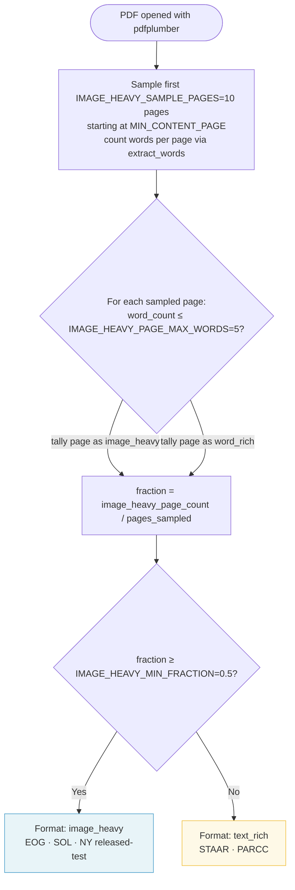
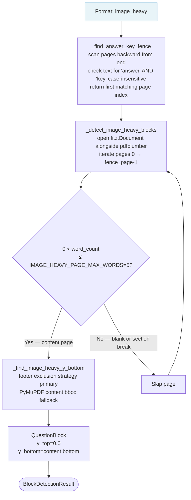
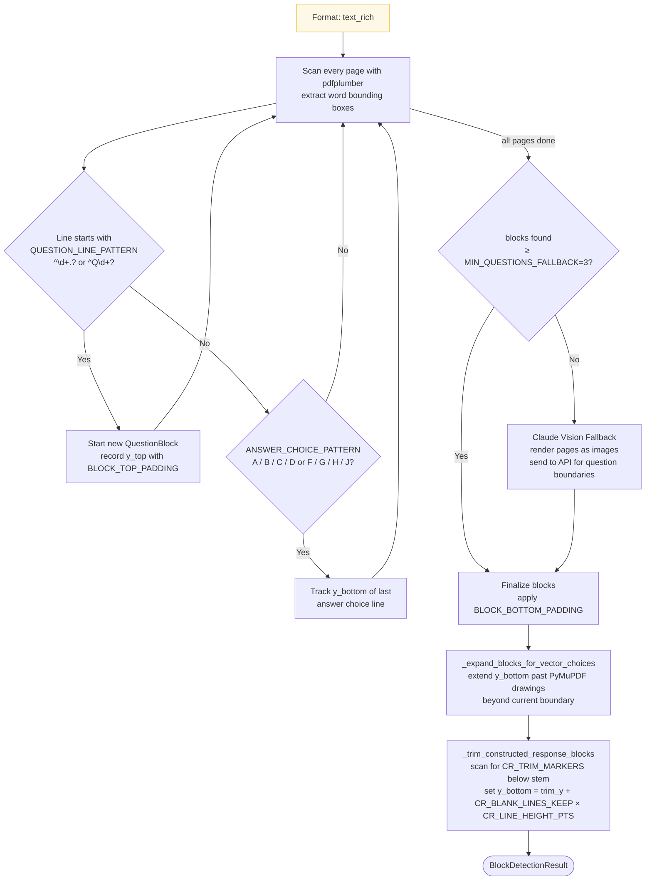
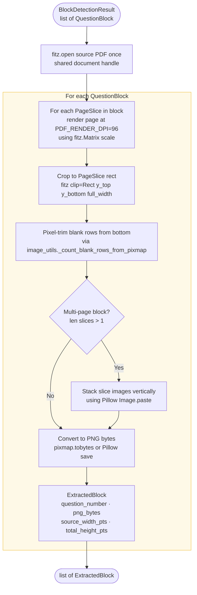
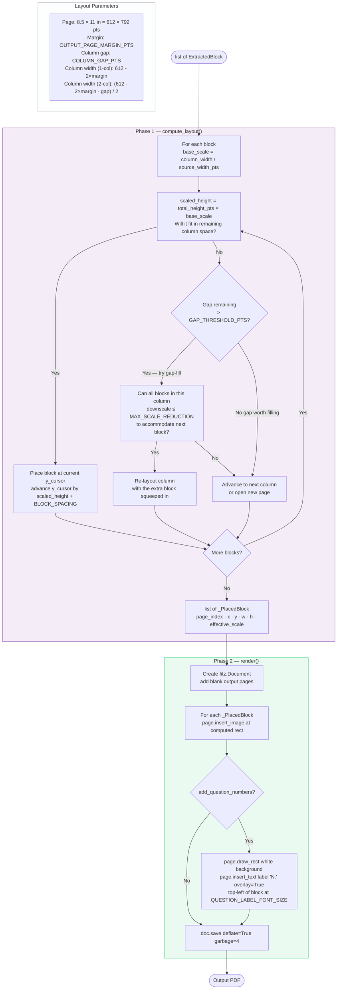
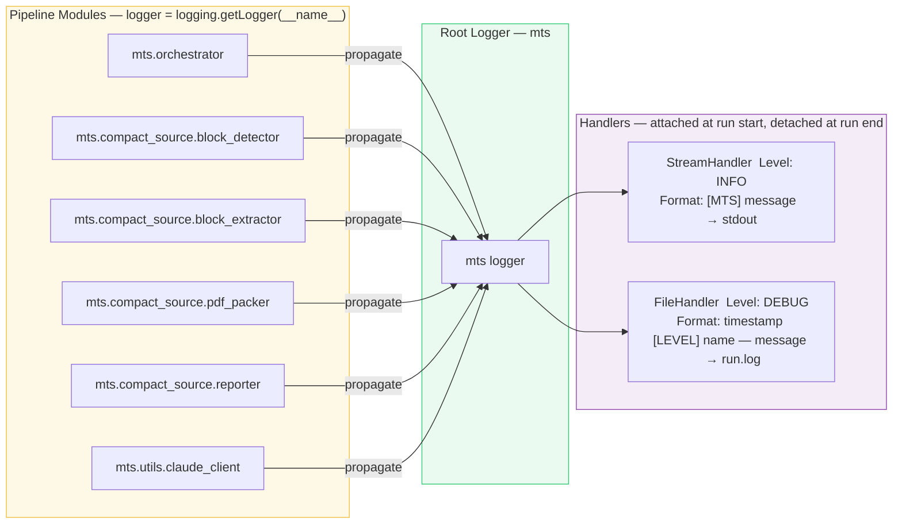

# compact_source — Low-Level Design (Detailed Design)

**Feature:** `compact_source`
**Document Type:** LLD — Detailed Design · Per-Algorithm Specification
**Version:** v1
**Status:** Active
**Date:** 2026-05-10
**Authority:** Governed by `compact_source-spec.md`; holistic context in `compact_source-hld.md`

> **Pipeline overview, data model, module dependencies, and architectural decisions →** see `compact_source-hld.md`

---

## 1. Stage 1 & 2 — Format Detection and Block Detection

### 1.1 Format Detection — `_classify_format()`



**Algorithm rationale:** An average-based threshold (previous approach) failed for PDFs with 2–3 word-rich cover/instruction pages followed by image-heavy question pages. The inflated average caused `text_rich` misclassification. A fraction-based majority vote counts per-page, making it robust to a small number of instruction pages (BUG-005 root cause and fix).

**Constants:**

| Constant | Default | Description |
|----------|---------|-------------|
| `IMAGE_HEAVY_SAMPLE_PAGES` | 10 | Pages sampled from `MIN_CONTENT_PAGE` onward |
| `IMAGE_HEAVY_MIN_FRACTION` | 0.5 | Minimum fraction of sampled pages that must be image-heavy |
| `IMAGE_HEAVY_PAGE_MAX_WORDS` | 5 | Maximum word count for a page to be counted as image-heavy |
| `IMAGE_HEAVY_AVG_WORDS_THRESHOLD` | 10 | Retained for backward compatibility — not used by classifier |

**Failure modes:**

| Situation | Behavior |
|-----------|----------|
| PDF has < 3 non-blank pages | Classify as `image_heavy` (conservative) |
| pdfplumber raises exception during sampling | Raise `DetectionError` with page index and exception detail |
| All sampled pages have 0 words | Classify as `image_heavy` |

---

### 1.2 block Detection — `image_heavy` Path



**`_find_image_heavy_y_bottom` — two-strategy approach:**

*Primary — footer exclusion (preferred):*
1. Collect all words in the bottom `IMAGE_HEAVY_FOOTER_ZONE_FRACTION` (15%) of the page
2. Join text; if it matches `IMAGE_HEAVY_FOOTER_PATTERN` (`^\d+ of \d+$`) → confirmed footer
3. Return `max(0, footer_top - BLOCK_BOTTOM_PADDING)`

*Fallback — PyMuPDF content bboxes (when no footer found):*
1. Collect `max_y` across: `get_text("blocks")` (footer-filtered) + `get_image_info()` + `get_drawings()`
2. If `max_y > 0`: return `min(max_y + BLOCK_BOTTOM_PADDING, page_height)`
3. Else: return `page_height`

---

### 1.3 Block Detection — `text_rich` Path



**EARS Requirement coverage (US-05):** see `compact_source-prd.md §US-05` for REQ-05-U1 through REQ-05-O2.

**Constructed-response trimming — `_trim_constructed_response_blocks()`:**

Called after `_expand_blocks_for_vector_choices()`. For each block:
1. Scan pdfplumber lines from `y_top` downward
2. Find first line whose text (lowercased, stripped) starts with any `CR_TRIM_MARKERS` entry
3. If match found at `trim_y`: `new_y_bottom = trim_y + CR_BLANK_LINES_KEEP × CR_LINE_HEIGHT_PTS`
4. Clamp: `new_y_bottom = min(new_y_bottom, b.y_bottom)` and `max(new_y_bottom, trim_y + CR_LINE_HEIGHT_PTS)`

```
CR_TRIM_MARKERS = ["answer", "show your work", "explain", "describe", "justify", "write your answer"]
```

---

## 2. Stage 3 — Block Extraction — `BlockExtractor.extract()`



**Constants:**

| Constant | Default | Description |
|----------|---------|-------------|
| `PDF_RENDER_DPI` | 96 | DPI for rasterizing source pages during extraction |
| `BLOCK_BOTTOM_PADDING` | 4 pts | Padding added below detected content bottom |
| `BLOCK_TOP_PADDING` | 2 pts | Padding subtracted above question-line y_top |

**Blank-row pixel trimming** (`image_utils.py`): walks rows from the bottom of the rendered pixmap; stops when a non-near-white pixel is found or `max_fraction` (0.5) of the image height is scanned. Blank pixel threshold: all RGB channels ≥ 245.

---

## 3. Stage 4 — Page Packing — `PdfPacker.pack()`



**Constants:**

| Constant | Default | Description |
|----------|---------|-------------|
| `OUTPUT_PAGE_MARGIN_PTS` | 36 pts | Page margin on all sides (0.5 in) |
| `COLUMN_GAP_PTS` | 12 pts | Gap between columns in 2-col layout |
| `GAP_THRESHOLD_PTS` | 50 pts | Minimum gap worth attempting a gap-fill |
| `MAX_SCALE_REDUCTION` | 0.85 | Minimum allowed scale factor relative to base_scale during gap-fill |
| `BLOCK_SPACING` | 6 pts | Vertical gap between blocks on the same column |
| `QUESTION_LABEL_FONT_SIZE` | 10.0 pts | Font size for question number overlay |

---

## 4. Stage 5 — Reporting — `Reporter.generate()`

The reporter consumes the completed output PDF and the `BlockDetectionResult` to produce two markdown artifacts.

**`{stem}_compaction-report.md`** contains:
- Run metadata (run ID, source file, grade, subject, columns, scale factor)
- File size table: `source_size → output_size (delta, pct reduction)` — if output is larger, states "N KB larger" not "N KB saved"
- Block count and page count comparison
- Whitespace efficiency table: per-block `total_height_pts / page_height`; blocks ≥ 95% flagged `⚠ OVERSIZED`
- Visual Comparison section (if `--compare` was used): per-page SSIM score table; omitted on clean runs
- Overall verdict: `PASS` or `FAIL` (FAIL if any block is OVERSIZED or comparator finds pages below threshold)

**`{stem}_source-boundary-map.md`** contains:
- One row per detected block: question number, source pages, `y_top`, `y_bottom`, `total_height_pts`

---

## 5. Stage 6 (Optional) — Visual Comparator — `compare_pdfs()`

Implements spec §14 (US-11).

**Algorithm:**
1. Render both output PDF and golden PDF at `COMPARATOR_RENDER_DPI` (default: 150)
2. For each page pair, compute SSIM score via `skimage.metrics.structural_similarity`
3. Pages with SSIM < `COMPARATOR_SIMILARITY_THRESHOLD` (default: 0.97) → flagged `REVIEW`
4. If output has more pages than golden → extra pages flagged `REVIEW`
5. If output has fewer pages than golden → missing pages flagged `ABSENT`
6. Overall verdict: `REVIEW` if any page flagged; `PASS` if all pages ≥ threshold

**Verdict semantics:** The comparator never produces `FAIL`. `REVIEW` is a signal to the operator — the human makes the final determination.

---

## 6. Telemetry Schema — `run-telemetry.json`

Produced at the end of every `run_compact_source()` call (Phase 2, IMP-CS-003/004).

```json
{
  "schema_version": "1.0",
  "run_id": "20260426_153201",
  "source_file": "STAAR_Grade3_2022.pdf",
  "parameters": {
    "grade": 3, "subject": "Math", "columns": 1,
    "scale_factor": 100.0, "max_pages": null, "problem_list": "ALL"
  },
  "format_detection": {
    "format_detected": "text_rich",
    "image_heavy_fraction": 0.1,
    "sample_pages_used": 10,
    "duration_s": 0.42
  },
  "block_detection": {
    "blocks_detected": 32,
    "used_vision_fallback": false,
    "answer_key_fence_page": null,
    "duration_s": 3.11
  },
  "block_extraction": { "blocks_extracted": 32, "duration_s": 4.87 },
  "page_packing": { "input_blocks": 32, "output_pages": 9, "duration_s": 1.22 },
  "source_stats": { "page_count": 35, "file_size_bytes": 2418022 },
  "output_stats": { "page_count": 9, "file_size_bytes": 1020512 },
  "summary": {
    "pages_saved": 26, "page_reduction_pct": 74.3,
    "size_saved_bytes": 1397510, "size_reduction_pct": 57.8,
    "verdict": "PASS"
  },
  "defects": [],
  "timings": { "total_duration_s": 9.62 }
}
```

**Defect entry schema:**
```json
{ "stage": "block_detection", "severity": "warning",
  "code": "VISION_FALLBACK_USED",
  "message": "Text scan found < 3 blocks; Claude vision fallback activated.",
  "context": { "blocks_before_fallback": 2 } }
```

**Defect codes:**

| Code | Stage | Severity | Trigger |
|------|-------|----------|---------|
| `VISION_FALLBACK_USED` | `block_detection` | `warning` | Regex scan < 3 blocks; Claude activated |
| `ZERO_BLOCKS_DETECTED` | `block_detection` | `error` | No blocks after all detection paths |
| `ANSWER_KEY_FENCE_NOT_FOUND` | `block_detection` | `info` | No answer key page; all pages included |
| `OUTPUT_LARGER_THAN_SOURCE` | `reporting` | `info` | Output file size > source file size |

---

## 7. Logging Architecture



**Handler lifecycle:** Handlers are attached at the start of each `run_compact_source()` call and detached in a `finally` block. This prevents handler accumulation across multiple calls in batch (folder) mode — a common Python logging bug.

**Log levels:**

| Level | Used For |
|-------|---------|
| `DEBUG` | Per-page word counts, per-block coordinates, intermediate values |
| `INFO` | Stage start/end, block counts, file sizes, run ID, verdict |
| `WARNING` | Vision fallback activated, unexpected page structure, 0 blocks detected |
| `ERROR` | Exceptions before re-raising |

---

## 8. Phase Delivery Log

Running record of what was built in each phase. Platform-level design stays in `platform/` — only compact_source-specific changes are recorded here.

---

### Phase 6.6 — Format Classification Fix + Human Gate

**Date:** 2026-05-08 | **Bug:** BUG-005 | **Status:** fix-applied

**Root cause:** `_classify_format` used average word count across first 10 pages. NY released-test PDFs have 2–3 instruction pages (50+ words) followed by image-heavy question pages. Average inflated above threshold → `text_rich` misclassification → regex matched "2023 Released" and "44" (answer-key footer) → 2 false-positive blocks instead of 28 real questions.

**Changes:**

| Module | Change |
|--------|--------|
| `block_detector.py` | `_classify_format`: average → fraction-based vote. New constant `IMAGE_HEAVY_MIN_FRACTION = 0.5`. |
| `orchestrator.py` | Added human question-count gate after Stage 2. Shows count, format, low-count warning. Prompts `[Y/n]`. Added `auto_confirm: bool = False`. Added `--yes`/`-y` CLI flag. |
| `scripts/compact_runner.py` | Fixed mode name `compact_source` → `compact_source_math`. Added `--yes` flag to subprocess calls. |

**Verification command:**
```bash
python -m src.orchestrator compact_source_math \
  --pdf "docs/exams/2026-EOGs/math/05_08_2026/NY_Math_Grade4_2023_Released_Test_Questions.pdf" \
  --grade 4 --subject Math
```
Expected: human gate prompts, detected count ~27 (not 2), pipeline completes on `Y`.

---

### Phase 6.5 — Question Number Labels (IMP-CS-018)

**Date:** 2026-04-27 | **Backlog:** IMP-CS-018 | **Status:** done

EOG source PDFs embed question numbers as page footer text ("1 of 40"). Footer is removed during `y_bottom` crop (correct behavior for BUG-002). Without labels, output blocks have no question numbers — a student-facing quality defect.

**Changes:**

| Module | Change |
|--------|--------|
| `pdf_packer.py` | `PdfPacker.__init__`: added `add_question_numbers: bool`, `question_start: int`. `_render()`: after `insert_image`, draws white-backed text label "N." at top-left using `draw_rect` + `insert_text(overlay=True)`. |
| `orchestrator.py` | Passes `add_question_numbers=True` when `is_image_heavy`; adds `--no-question-numbers` and `--question-start N` CLI flags. |
| `config.py` | Added `QUESTION_LABEL_FONT_SIZE = 10.0`. |

---

### Phase 6.4 — Block Height Efficiency Checker (IMP-CS-017)

**Date:** 2026-04-27 | **Backlog:** IMP-CS-017 | **Status:** done

Post-extraction check: `reporter.py::_build_whitespace_section` measures `total_height_pts / page_height` per block. Blocks ≥ `IMAGE_HEAVY_HEIGHT_WARN_FRACTION` (0.95) are flagged `⚠ OVERSIZED` in the compaction report. Verdict set to FAIL if any block is oversized. Check runs on post-extractor heights (after pixel-trimmer).

---

### Phase 2 — Observability (IMP-CS-003, IMP-CS-004)

**Status:** Designed — pending implementation
**Platform docs:** `platform/observability/platform-observability-spec.md` · `platform/observability/platform-observability-design.md`

See §6 (Telemetry Schema) and §7 (Logging Architecture) in this document for the full design.

**Modules to change when implementing:**

| Module | Change |
|--------|--------|
| `orchestrator.py` | `_setup_run_logging()` / `_teardown_run_logging()`; wrap each stage with `perf_counter()`; build and save `RunTelemetry`; write `batch-telemetry.json` in folder mode |
| `block_detector.py` | Replace all `print()` → `logger.debug/info/warning` |
| `block_extractor.py` | Replace all `print()` → `logger.debug/info` |
| `pdf_packer.py` | Replace all `print()` → `logger.debug/info` |
| `reporter.py` | Replace all `print()` → `logger.debug/info` |
| **New** `telemetry.py` | `RunTelemetry` dataclass + JSON serialization + `save()` |

**Design decisions:**

| # | Decision | Rationale |
|---|----------|-----------|
| D1 | Timing in orchestrator, not pipeline modules | Keeps modules single-responsibility |
| D2 | Two handlers: StreamHandler (INFO) + FileHandler (DEBUG) | Users see clean progress; `run.log` captures full debug trace |
| D3 | Handlers attached/detached per run | Prevents handler accumulation in batch mode |
| D4 | `RunTelemetry` as plain dataclass, not Pydantic | No new dependency; Pydantic adds value for external input, not for internal accumulation |
| D5 | Defect codes as uppercase strings, not enums | Easier to extend; Phase 5 self-healing matches on code string |

---

### Phases 3–5 — Planned

| Phase | Theme | Backlog Items | Status |
|-------|-------|--------------|--------|
| Phase 3 — Resilience | Pipeline never crashes silently | CS-005, CS-006, CS-007 | 🔲 Planned |
| Phase 4 — Quality | System knows when it has done a good job | CS-002, CS-008, CS-009 | 🔲 Planned |
| Phase 5 — Self-Improvement | System gets better without human intervention | CS-010, CS-011, CS-012 | 🔲 Planned |
