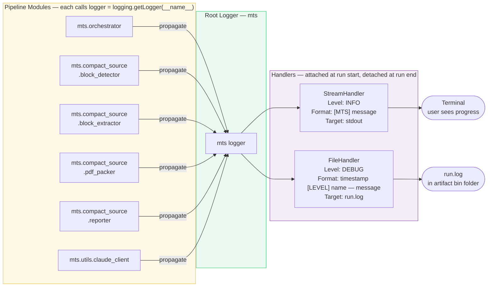

# compact_source Phase 2 — Observability Design

> **Superseded.** This document has been split into three focused documents:
>
> | Document | Purpose |
> |----------|---------|
> | [platform/observability/platform-observability-spec.md](../platform/observability/platform-observability-spec.md) | Platform contract — applies to all features |
> | [platform/observability/platform-observability-design.md](../platform/observability/platform-observability-design.md) | Implementation design — telemetry schema, logging architecture, class design |
> | [compact_source-phase2-delivery.md](compact_source-phase2-delivery.md) | compact_source delivery — feature-specific fields, modules changed, AC |

*This file is kept as a redirect only. Do not edit.*

---

## 1. Problem Statement

The pipeline currently has no machine-readable record of what happened in a run. It emits human-readable `print()` statements to stdout, but:

- `print()` cannot be filtered by severity — debug noise and real warnings look the same
- Nothing is written to a file — once the terminal closes, the run history is gone
- Downstream tooling (evaluator, self-healing engine, learnings extractor planned in Phase 4–5) has no structured input to read
- Timing is invisible — we don't know which stage is slow
- Defect tracking is manual — there is no machine-readable record of what went wrong

After Phase 2, every run produces:
1. `run-telemetry.json` — machine-readable run summary (inputs, outputs, timing, defects)
2. `run.log` — full timestamped log of every pipeline event, written to the artifact folder

---

## 2. Goals and Non-Goals

### Goals
- Every run writes `run-telemetry.json` to the artifact run folder
- Every run writes `run.log` to the artifact run folder
- Terminal output is preserved (users still see progress)
- All bare `print()` calls in the pipeline are replaced with `logging` calls
- No change to external behavior: output PDF, reports, exit codes unchanged
- Batch (folder) runs write one `batch-telemetry.json` summarising all per-file runs

### Non-Goals
- Log shipping to external systems (out of scope for v1)
- Structured JSON log lines (plain text log is sufficient for now)
- Changing any pipeline logic — this phase is purely instrumentation
- Evaluator scoring (Phase 4)

---

## 3. Telemetry Schema

### 3.1 Per-Run: `{stem}_run-telemetry.json`

Written at the end of every `run_compact_source()` call, before exit.

```json
{
  "schema_version": "1.0",
  "run_id": "20260426_153201",
  "source_file": "STAAR_Grade3_2022.pdf",
  "source_path": "docs/exams/STAAR_Grade3_2022.pdf",
  "timestamp_utc": "2026-04-26T15:32:01Z",

  "parameters": {
    "grade": 3,
    "subject": "Math",
    "columns": 1,
    "scale_factor": 100.0,
    "max_pages": null,
    "max_block_pages": 2,
    "problem_list": "ALL"
  },

  "format_detection": {
    "format_detected": "text_rich",
    "avg_words_per_page": 87.4,
    "sample_pages_used": 10,
    "duration_s": 0.42
  },

  "block_detection": {
    "blocks_detected": 32,
    "blocks_after_filter": 32,
    "used_vision_fallback": false,
    "answer_key_fence_page": null,
    "duration_s": 3.11
  },

  "block_extraction": {
    "blocks_extracted": 32,
    "duration_s": 4.87
  },

  "page_packing": {
    "input_blocks": 32,
    "output_pages": 9,
    "duration_s": 1.22
  },

  "source_stats": {
    "page_count": 35,
    "file_size_bytes": 2418022
  },

  "output_stats": {
    "page_count": 9,
    "file_size_bytes": 1020512,
    "output_path": ".agent/evals/runs/.../bin/STAAR_Grade3_2022_Compacted_1col_20260426_153201.pdf"
  },

  "summary": {
    "pages_saved": 26,
    "page_reduction_pct": 74.3,
    "size_saved_bytes": 1397510,
    "size_reduction_pct": 57.8,
    "verdict": "PASS"
  },

  "defects": [],

  "timings": {
    "total_duration_s": 9.62,
    "stage_breakdown": {
      "format_detection_s": 0.42,
      "block_detection_s": 3.11,
      "block_extraction_s": 4.87,
      "page_packing_s": 1.22,
      "reporting_s": 0.00
    }
  }
}
```

### 3.2 Defect Entry Schema

`defects` is an array. Each entry:
```json
{
  "stage": "block_detection",
  "severity": "warning",
  "code": "VISION_FALLBACK_USED",
  "message": "Text-based detection found < 3 blocks; Claude vision fallback activated.",
  "context": { "blocks_before_fallback": 2 }
}
```

| Field | Values |
|-------|--------|
| `stage` | `format_detection`, `block_detection`, `block_extraction`, `page_packing`, `reporting` |
| `severity` | `info`, `warning`, `error` |
| `code` | Short uppercase snake_case code string (enables programmatic matching in Phase 5) |
| `context` | Optional object with additional diagnostic data |

### 3.3 Batch Summary: `batch-telemetry.json`

Written at end of folder-mode run by `main()` in `orchestrator.py`.

```json
{
  "schema_version": "1.0",
  "run_id": "20260426_153201",
  "timestamp_utc": "2026-04-26T15:35:44Z",
  "source_folder": "docs/exams/2026-EOGs",
  "files_processed": 3,
  "files_passed": 3,
  "files_failed": 0,
  "total_duration_s": 28.3,
  "runs": [
    {
      "source_file": "EOG_Grade3_2014.pdf",
      "verdict": "PASS",
      "blocks_detected": 40,
      "output_pages": 12,
      "total_duration_s": 9.1
    }
  ]
}
```

---

## 4. Logging Architecture

### 4.1 Logger Hierarchy



Python's `logging` module uses a dot-separated hierarchy. Each module gets its own named logger. All loggers propagate to a shared root logger configured by the orchestrator.

```
mts                          ← root logger (configured in orchestrator.py)
├── mts.orchestrator
├── mts.compact_source
│   ├── mts.compact_source.block_detector
│   ├── mts.compact_source.block_extractor
│   ├── mts.compact_source.pdf_packer
│   └── mts.compact_source.reporter
└── mts.utils
    ├── mts.utils.artifact_writer
    └── mts.utils.claude_client
```

Each module's first line:
```python
import logging
logger = logging.getLogger(__name__)   # e.g., "src.compact_source.block_detector"
```

### 4.2 Handler Configuration

Two handlers are attached to the root `mts` logger at the start of `run_compact_source()`:

| Handler | Target | Level | Formatter |
|---------|--------|-------|-----------|
| `StreamHandler` | stdout | `INFO` | `[MTS] %(message)s` (matches current terminal output style) |
| `FileHandler` | `{run_path}/run.log` | `DEBUG` | `%(asctime)s [%(levelname)s] %(name)s — %(message)s` |

The `FileHandler` is attached to the run folder immediately after the `ArtifactWriter` is initialized, so all subsequent log calls in the run are captured.

The `StreamHandler` replaces the current `print()` calls with no visible change to the user.

### 4.3 Log Levels Used

| Level | Used For |
|-------|---------|
| `DEBUG` | Per-page word counts, per-block coordinates, intermediate values |
| `INFO` | Stage start/end, block counts, file sizes, run ID, result verdict |
| `WARNING` | Vision fallback activated, unexpected page structure, 0 blocks detected |
| `ERROR` | Exceptions before they are re-raised |

### 4.4 Handler Lifecycle

Handlers must be explicitly removed after each run to avoid accumulating duplicate handlers in folder-mode (where `run_compact_source()` is called in a loop):

```python
# At start of run_compact_source():
_setup_run_logging(artifact_writer.run_path)

# At end of run_compact_source() (in a finally block):
_teardown_run_logging()
```

The setup/teardown functions manage handler attach/detach on the `mts` logger.

---

## 5. New Module: `src/compact_source/telemetry.py`

### 5.1 Responsibility

Owns the `RunTelemetry` dataclass and its JSON serialization. The orchestrator builds it incrementally and calls `.save()` at the end of the run.

### 5.2 Class Design

```python
@dataclass
class StageTimings:
    format_detection_s: float = 0.0
    block_detection_s: float = 0.0
    block_extraction_s: float = 0.0
    page_packing_s: float = 0.0
    reporting_s: float = 0.0
    total_duration_s: float = 0.0

@dataclass
class Defect:
    stage: str
    severity: str          # "info" | "warning" | "error"
    code: str              # e.g., "VISION_FALLBACK_USED"
    message: str
    context: dict = field(default_factory=dict)

@dataclass
class RunTelemetry:
    schema_version: str = "1.0"
    run_id: str = ""
    source_file: str = ""
    source_path: str = ""
    timestamp_utc: str = ""

    # Parameters
    grade: int = 0
    subject: str = ""
    columns: int = 1
    scale_factor: float = 100.0
    max_pages: int | None = None
    max_block_pages: int = 2
    problem_list: str = "ALL"

    # Stage results (populated incrementally)
    format_detected: str = ""
    avg_words_per_page: float = 0.0
    sample_pages_used: int = 0
    blocks_detected: int = 0
    blocks_after_filter: int = 0
    used_vision_fallback: bool = False
    answer_key_fence_page: int | None = None
    blocks_extracted: int = 0
    output_pages: int = 0

    # File stats
    source_page_count: int = 0
    source_size_bytes: int = 0
    output_size_bytes: int = 0
    output_path: str = ""

    # Timing + defects
    timings: StageTimings = field(default_factory=StageTimings)
    defects: list[Defect] = field(default_factory=list)

    # Computed summary fields (computed on save)
    verdict: str = ""

    def add_defect(self, stage: str, severity: str, code: str,
                   message: str, context: dict = None) -> None: ...

    def to_dict(self) -> dict: ...          # converts to schema-compliant dict

    def save(self, artifact_writer: ArtifactWriter, stem: str) -> Path:
        """Serialize to JSON and write {stem}_run-telemetry.json."""
```

### 5.3 Usage Pattern in Orchestrator

```python
import time
from src.compact_source.telemetry import RunTelemetry

tel = RunTelemetry(run_id=artifact_writer.run_id, source_file=pdf_path.name, ...)

t0 = time.perf_counter()
detection_result = detector.detect(pdf_path)
tel.block_detection_s = time.perf_counter() - t0
tel.blocks_detected = detection_result.total_questions

# ... (same pattern for each stage)

tel.verdict = "PASS" if passed else "FAIL"
tel.save(artifact_writer, stem=pdf_path.stem)
```

---

## 6. Module Interface Changes

### 6.1 Changes Required

| Module | Change |
|--------|--------|
| `orchestrator.py` | Replace all `print()` with `logger.info/warning/error`; add timing around each stage; create `RunTelemetry`; call `tel.save()` before return; add `_setup_run_logging()` / `_teardown_run_logging()`; write `batch-telemetry.json` in folder mode |
| `block_detector.py` | Replace all `print()` with `logger.debug/info/warning`; no interface change |
| `block_extractor.py` | Replace all `print()` with `logger.debug/info`; no interface change |
| `pdf_packer.py` | Replace all `print()` with `logger.debug/info`; no interface change |
| `reporter.py` | Replace all `print()` with `logger.debug/info`; no interface change |
| `artifact_writer.py` | Add `log_path` property; no interface change to existing methods |
| `claude_client.py` | Replace all `print()` with `logger.debug/warning`; no interface change |
| **New** `telemetry.py` | New module |

### 6.2 No Breaking Changes

- `run_compact_source()` signature is unchanged
- Output PDF, reports, exit codes are unchanged
- `BlockDetector.detect()`, `BlockExtractor.extract()`, `PdfPacker.pack()`, `Reporter.generate()` signatures are unchanged
- Timing is measured in the orchestrator by wrapping calls with `time.perf_counter()` — pipeline modules do not return timing data

---

## 7. Data Flow Diagram

```mermaid
flowchart TD
    A([orchestrator.py\nrun_compact_source]) --> B[_setup_run_logging\nattach FileHandler + StreamHandler]
    B --> C[RunTelemetry\ninitialize dataclass]
    C --> D

    subgraph S1["Stage 1 — Format Detection  ⏱"]
        D[BlockDetector._classify_format] --> D1[tel.format_detected\ntel.avg_words_per_page\ntel.format_detection_s]
    end

    D1 --> E

    subgraph S2["Stage 2 — Block Detection  ⏱"]
        E[BlockDetector.detect] --> E1[tel.blocks_detected\ntel.used_vision_fallback\ntel.answer_key_fence_page\ntel.block_detection_s]
    end

    E1 --> F

    subgraph S3["Stage 3 — Block Extraction  ⏱"]
        F[BlockExtractor.extract] --> F1[tel.blocks_extracted\ntel.block_extraction_s]
    end

    F1 --> G

    subgraph S4["Stage 4 — Page Packing  ⏱"]
        G[PdfPacker.pack] --> G1[tel.output_pages\ntel.page_packing_s]
    end

    G1 --> H

    subgraph S5["Stage 5 — Reporting"]
        H[Reporter.generate] --> H1[tel.reporting_s]
    end

    H1 --> I[tel.verdict = PASS / FAIL]
    I --> J[tel.save → {stem}_run-telemetry.json]
    J --> K[_teardown_run_logging\ndetach handlers, close file]
    K --> L([return])

    style S1 fill:#e8f4f8,stroke:#4a9eca
    style S2 fill:#e8f4f8,stroke:#4a9eca
    style S3 fill:#e8f4f8,stroke:#4a9eca
    style S4 fill:#e8f4f8,stroke:#4a9eca
    style S5 fill:#e8f4f8,stroke:#4a9eca
```

```
orchestrator.run_compact_source()
│
├── _setup_run_logging(run_path)       ← attaches FileHandler + StreamHandler
│
├── tel = RunTelemetry(...)             ← start accumulating telemetry
│
├── t0 = perf_counter()
├── detector.detect(pdf_path)          ← logger calls go to run.log + stdout
├── tel.format_detected = ...
├── tel.block_detection_s = perf_counter() - t0
│
├── t1 = perf_counter()
├── extractor.extract(...)
├── tel.block_extraction_s = perf_counter() - t1
│
├── t2 = perf_counter()
├── packer.pack(...)
├── tel.page_packing_s = perf_counter() - t2
│
├── reporter.generate(...)
│
├── tel.verdict = "PASS" | "FAIL"
├── tel.save(artifact_writer, stem)    ← writes {stem}_run-telemetry.json
│
└── _teardown_run_logging()            ← detaches handlers, closes file
```

---

## 8. File Layout After Phase 2

```
.agent/evals/runs/math_worksheet_generation_from_source/20260426_153201/bin/
│
├── STAAR_Grade3_2022_Compacted_1col_20260426_153201.pdf   ← unchanged
├── STAAR_Grade3_2022_compaction-report.md                 ← unchanged
├── STAAR_Grade3_2022_source-boundary-map.md               ← unchanged
├── STAAR_Grade3_2022_run-telemetry.json                   ← NEW (IMP-003)
└── run.log                                                ← NEW (IMP-004)
```

For a 3-file batch run:
```
.../20260426_153201/bin/
├── EOG_Grade3_run-telemetry.json
├── EOG_Grade4_run-telemetry.json
├── EOG_Grade5_run-telemetry.json
├── batch-telemetry.json                                   ← NEW (IMP-003)
└── run.log                                                ← single shared log
```

---

## 9. Design Decisions

| # | Decision | Rationale |
|---|----------|-----------|
| D1 | Timing measured in orchestrator, not in pipeline modules | Pipeline modules stay single-responsibility; orchestrator is already the coordinator |
| D2 | Two handlers: StreamHandler (INFO) + FileHandler (DEBUG) | Users see clean INFO output; `run.log` captures full debug trace for diagnosis |
| D3 | Handlers attached/detached per run | Prevents handler accumulation in batch (folder) mode — a common Python logging bug |
| D4 | `RunTelemetry` is a plain dataclass, not a Pydantic model | No new dependency; simple enough for a dataclass; Pydantic adds value when deserializing external input (not the case here) |
| D5 | `telemetry.py` in `src/compact_source/`, not `src/utils/` | Telemetry schema is specific to the compact_source pipeline; utils should be feature-agnostic |
| D6 | Defect codes are uppercase snake_case strings, not enums | Easier to extend without modifying `telemetry.py`; Phase 5 self-healing engine matches on code string |
| D7 | `batch-telemetry.json` is a separate file, not embedded in per-file telemetry | Batch summary is a different unit of analysis from per-file detail; keeps each file's telemetry self-contained |
| D8 | `verdict` field in telemetry is always `"PASS"` or `"FAIL"` | Downstream tooling needs a binary signal; detailed defects tell the rest of the story |

---

## 10. Open Questions

| # | Question | Owner | Status |
|---|----------|-------|--------|
| Q1 | Should `run.log` truncate at a max size (e.g., 10 MB) to prevent runaway logs on very large batches? | Ravi | Open |
| Q2 | Should `format_detection` timing be tracked separately inside `BlockDetector.detect()`, or is stage-level timing (all of detect() lumped together) sufficient? | Tech | Open — start with stage-level; split if needed |
| Q3 | Should `batch-telemetry.json` include full per-file telemetry inline, or only the summary rows? | Tech | Open — summary rows only for now; full telemetry is in per-file JSON |

---

## 11. Acceptance Criteria (maps to IMP-003, IMP-004)

| ID | Criterion | Testable? |
|----|-----------|-----------|
| AC-01 | Every run produces `{stem}_run-telemetry.json` in the artifact bin folder | Yes — check file exists |
| AC-02 | `run-telemetry.json` schema matches §3.1 exactly (all fields present, correct types) | Yes — JSON schema validation |
| AC-03 | `timings.total_duration_s` equals the sum of stage breakdown values ± 0.1s | Yes — arithmetic check |
| AC-04 | Every run produces `run.log` in the artifact bin folder | Yes — check file exists |
| AC-05 | `run.log` contains one line per pipeline stage at INFO level | Yes — grep for stage markers |
| AC-06 | No bare `print()` remains in `src/compact_source/` or `src/orchestrator.py` | Yes — `grep -r "print(" src/` returns 0 results |
| AC-07 | Batch run produces `batch-telemetry.json` with correct `files_processed` count | Yes — count PDFs in folder vs JSON value |
| AC-08 | Terminal output is visually unchanged from before Phase 2 | Yes — manual review; stdout still shows progress |
| AC-09 | Running 3 PDFs in folder mode produces exactly one `run.log` (not three) | Yes — count files |
| AC-10 | Handler teardown works: running two separate `run_compact_source()` calls does not duplicate log lines | Yes — count occurrences of a known log message |
