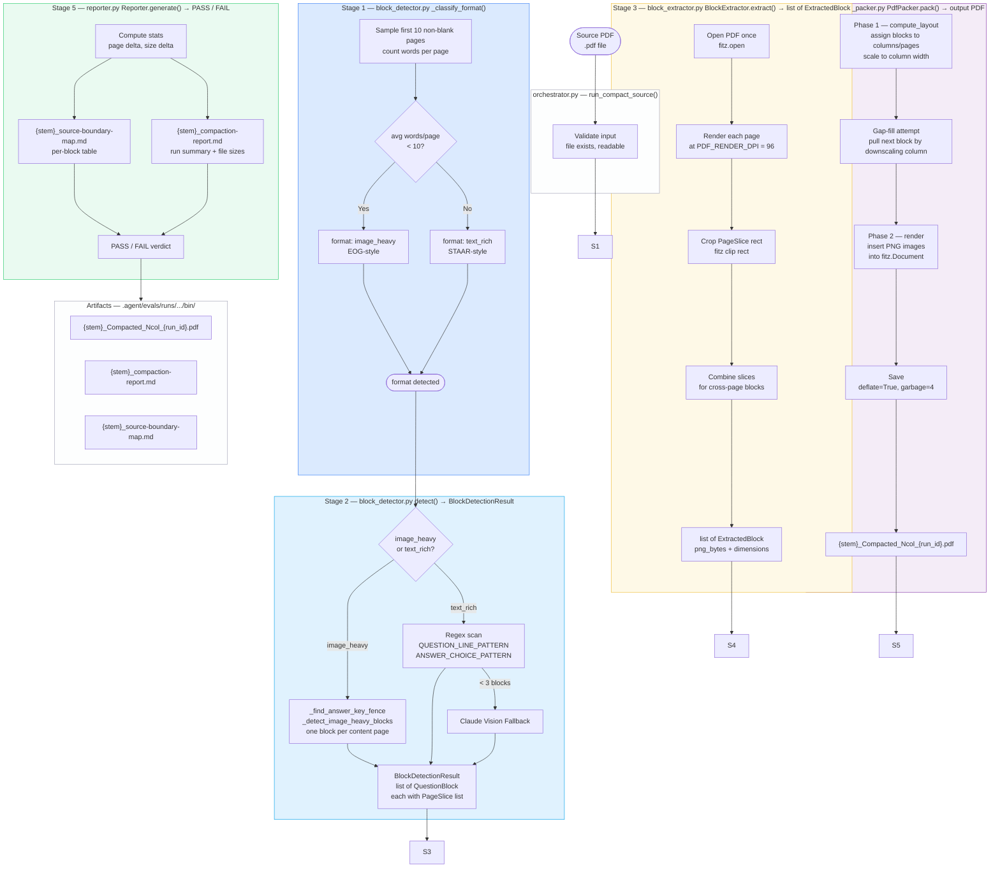
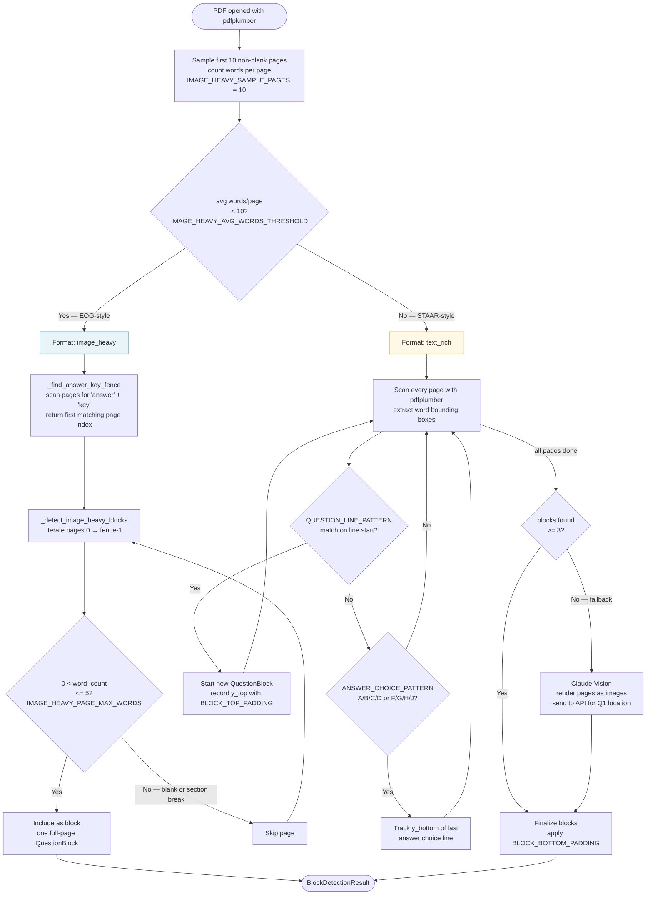
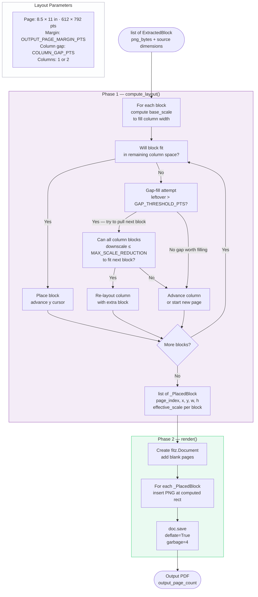
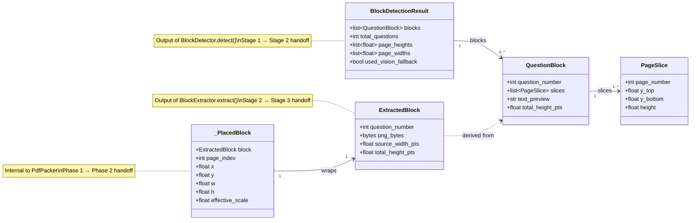
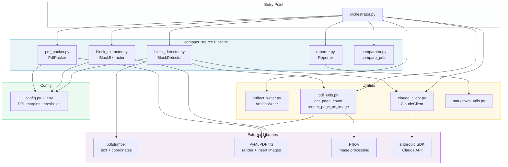

# compact_source — System Design

> **Superseded.** Content merged into [compact_source-design.md](compact_source-design.md) §1–§5.

---

## 1. End-to-End Pipeline

Five stages. Stages 1 and 2 both live in `block_detector.py` — format detection feeds directly into block detection within the same `detect()` call.

---

## 2. Stage 1 — Format Detection & Block Detection Logic

---

## 3. Stage 3 — PdfPacker Layout Algorithm

---

## 4. Data Model & Stage Handoffs

---

## 5. Module Dependency Map

