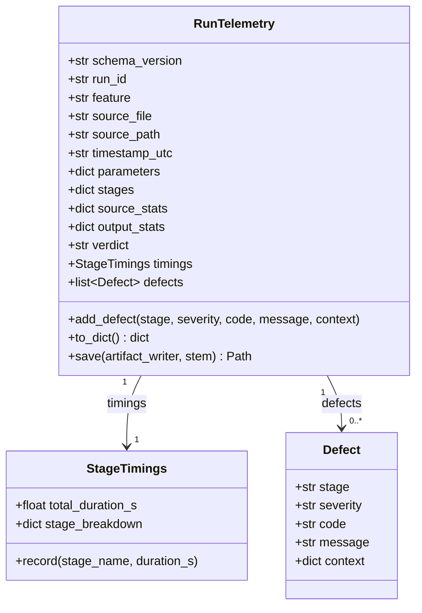
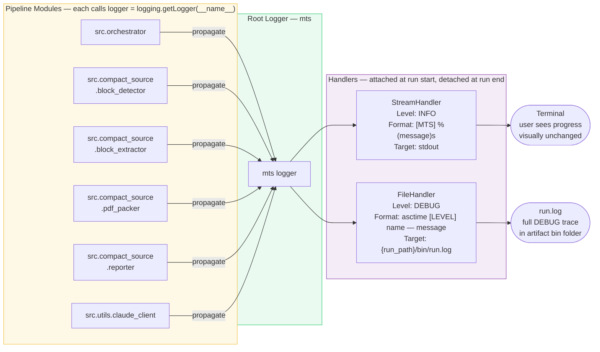

# platform-observability-design.md

**Theme:** Platform
**Sub-theme:** Observability
**Version:** v1
**Status:** Active
**Date:** 2026-04-26
**Spec:** [platform-observability-spec.md](platform-observability-spec.md)

This document describes **how** the observability platform is implemented — module design, class structure, logging wiring, and data flow. The **what** (contract, required fields, testability) lives in the spec.

---

## 1. New Module: `src/utils/telemetry.py`

`telemetry.py` lives in `src/utils/` because it is platform infrastructure shared by all features — not feature-specific logic. It owns the `RunTelemetry` dataclass and its JSON serialisation.

### 1.1 Class Structure



### 1.2 Full Class Skeleton

```python
# src/utils/telemetry.py

import datetime
import json
from dataclasses import dataclass, field
from pathlib import Path


@dataclass
class StageTimings:
    total_duration_s: float = 0.0
    stage_breakdown: dict[str, float] = field(default_factory=dict)

    def record(self, stage_name: str, duration_s: float) -> None:
        self.stage_breakdown[stage_name] = round(duration_s, 3)


@dataclass
class Defect:
    stage: str
    severity: str       # "info" | "warning" | "error"
    code: str           # e.g. "VISION_FALLBACK_USED"
    message: str
    context: dict = field(default_factory=dict)


@dataclass
class RunTelemetry:
    schema_version: str = "1.0"
    run_id: str = ""
    feature: str = ""
    source_file: str = ""
    source_path: str = ""
    timestamp_utc: str = field(
        default_factory=lambda: datetime.datetime.utcnow().isoformat() + "Z"
    )
    parameters: dict = field(default_factory=dict)
    stages: dict = field(default_factory=dict)         # feature fills this
    source_stats: dict = field(default_factory=dict)
    output_stats: dict = field(default_factory=dict)
    verdict: str = ""
    timings: StageTimings = field(default_factory=StageTimings)
    defects: list[Defect] = field(default_factory=list)

    def add_defect(
        self,
        stage: str,
        severity: str,
        code: str,
        message: str,
        context: dict | None = None,
    ) -> None:
        self.defects.append(
            Defect(stage=stage, severity=severity, code=code,
                   message=message, context=context or {})
        )

    def to_dict(self) -> dict:
        return {
            "schema_version": self.schema_version,
            "run_id": self.run_id,
            "feature": self.feature,
            "source_file": self.source_file,
            "source_path": self.source_path,
            "timestamp_utc": self.timestamp_utc,
            "parameters": self.parameters,
            "stages": self.stages,
            "source_stats": self.source_stats,
            "output_stats": self.output_stats,
            "summary": {"verdict": self.verdict},
            "defects": [vars(d) for d in self.defects],
            "timings": {
                "total_duration_s": round(self.timings.total_duration_s, 3),
                "stage_breakdown": self.timings.stage_breakdown,
            },
        }

    def save(self, artifact_writer, stem: str) -> Path:
        content = json.dumps(self.to_dict(), indent=2)
        return artifact_writer.write(f"{stem}_run-telemetry.json", content)
```

### 1.3 Why `parameters` and `stages` Are Plain Dicts

`RunTelemetry` stores feature-specific data as plain `dict` rather than nested dataclasses. This keeps `telemetry.py` feature-agnostic — it does not import anything from `compact_source/` or `generate_worksheet/`. Each feature's orchestrator populates these dicts. The platform schema (§3 of the spec) defines which keys are required.

---

## 2. Logging Architecture

### 2.1 Logger Hierarchy



Each module declares its logger at the top of the file:
```python
import logging
logger = logging.getLogger(__name__)
```

All module loggers propagate up to the `mts` root logger. The root logger is the only logger that has handlers attached — this is intentional. Attaching handlers to child loggers would cause duplicate output.

### 2.2 Handler Configuration Table

| Handler | Target | Level | Formatter |
|---------|--------|-------|-----------|
| `StreamHandler` | stdout | `INFO` | `[MTS] %(message)s` |
| `FileHandler` | `{run_path}/bin/run.log` | `DEBUG` | `%(asctime)s [%(levelname)s] %(name)s — %(message)s` |

### 2.3 Handler Lifecycle Functions

Two private functions in `orchestrator.py` manage the handler lifecycle:

```python
_LOGGING_HANDLERS: list[logging.Handler] = []   # module-level, tracks attached handlers

def _setup_run_logging(run_log_path: Path) -> None:
    root = logging.getLogger("mts")
    root.setLevel(logging.DEBUG)

    # Stream handler — INFO to stdout
    sh = logging.StreamHandler(sys.stdout)
    sh.setLevel(logging.INFO)
    sh.setFormatter(logging.Formatter("[MTS] %(message)s"))

    # File handler — DEBUG to run.log
    fh = logging.FileHandler(run_log_path, encoding="utf-8")
    fh.setLevel(logging.DEBUG)
    fh.setFormatter(
        logging.Formatter("%(asctime)s [%(levelname)s] %(name)s — %(message)s")
    )

    root.addHandler(sh)
    root.addHandler(fh)
    _LOGGING_HANDLERS.extend([sh, fh])


def _teardown_run_logging() -> None:
    root = logging.getLogger("mts")
    for h in _LOGGING_HANDLERS:
        h.close()
        root.removeHandler(h)
    _LOGGING_HANDLERS.clear()
```

**Why this matters:** In batch (folder) mode, `run_compact_source()` is called in a loop. Without teardown, each call adds new handlers — by the 3rd file, every log line is printed 3 times to stdout and written 3 times to the log. The `_LOGGING_HANDLERS` list tracks attached handlers so they can all be cleanly removed.

---

## 3. Telemetry Data Flow

```mermaid
flowchart TD
    A([orchestrator.py\nrun_compact_source]) --> B["_setup_run_logging(run_log_path)\nattach StreamHandler + FileHandler"]
    B --> C["tel = RunTelemetry(\n  run_id, feature, source_file, ...\n)"]
    C --> D

    subgraph S1["Stage 1 — Format Detection  ⏱"]
        D[BlockDetector._classify_format] --> D1["tel.stages['format_detection'] = {\n  format_detected, avg_words_per_page,\n  sample_pages_used, duration_s\n}"]
    end

    D1 --> E

    subgraph S2["Stage 2 — Block Detection  ⏱"]
        E[BlockDetector.detect] --> E1["tel.stages['block_detection'] = {\n  blocks_detected, blocks_after_filter,\n  used_vision_fallback,\n  answer_key_fence_page, duration_s\n}"]
    end

    E1 --> F

    subgraph S3["Stage 3 — Block Extraction  ⏱"]
        F[BlockExtractor.extract] --> F1["tel.stages['block_extraction'] = {\n  blocks_extracted, duration_s\n}"]
    end

    F1 --> G

    subgraph S4["Stage 4 — Page Packing  ⏱"]
        G[PdfPacker.pack] --> G1["tel.stages['page_packing'] = {\n  input_blocks, output_pages, duration_s\n}"]
    end

    G1 --> H

    subgraph S5["Stage 5 — Reporting  ⏱"]
        H[Reporter.generate] --> H1["tel.stages['reporting'] = { duration_s }\ntel.source_stats = { page_count, size_bytes }\ntel.output_stats = { page_count, size_bytes, path }"]
    end

    H1 --> I["tel.verdict = 'PASS' | 'FAIL'\ntel.timings.total_duration_s = ..."]
    I --> J["tel.save(artifact_writer, stem)\n→ {stem}_run-telemetry.json"]
    J --> K["_teardown_run_logging()\nclose FileHandler, remove all handlers"]
    K --> L([return])

    style S1 fill:#e8f4f8,stroke:#4a9eca
    style S2 fill:#e8f4f8,stroke:#4a9eca
    style S3 fill:#e8f4f8,stroke:#4a9eca
    style S4 fill:#e8f4f8,stroke:#4a9eca
    style S5 fill:#e8f4f8,stroke:#4a9eca
```



### 3.1 Timing Pattern

Timing is always measured in `orchestrator.py` by wrapping each stage call with `time.perf_counter()`. Pipeline modules do not return timing data — this keeps them single-responsibility.

```python
import time

t0 = time.perf_counter()
detection_result = detector.detect(pdf_path)
tel.timings.record("block_detection_s", time.perf_counter() - t0)
tel.stages["block_detection"] = {
    "blocks_detected": detection_result.total_questions,
    "blocks_after_filter": len(filtered_blocks),
    "used_vision_fallback": detection_result.used_vision_fallback,
    "answer_key_fence_page": detection_result.answer_key_fence_page,
    "duration_s": tel.timings.stage_breakdown["block_detection_s"],
}
```

---

## 4. Artifact File Layout After Implementation

```
.agent/evals/runs/math_worksheet_generation_from_source/{run_id}/bin/
│
│  ── Single file run ──
├── {stem}_Compacted_1col_{run_id}.pdf        unchanged
├── {stem}_compaction-report.md               unchanged
├── {stem}_source-boundary-map.md             unchanged
├── {stem}_run-telemetry.json                 NEW
└── run.log                                   NEW
```

```
│  ── Batch (folder) run — 3 PDFs ──
├── EOG_Grade3_Compacted_2col_{run_id}.pdf
├── EOG_Grade4_Compacted_2col_{run_id}.pdf
├── EOG_Grade5_Compacted_2col_{run_id}.pdf
├── EOG_Grade3_run-telemetry.json             NEW — per file
├── EOG_Grade4_run-telemetry.json             NEW — per file
├── EOG_Grade5_run-telemetry.json             NEW — per file
├── batch-telemetry.json                      NEW — batch summary
└── run.log                                   NEW — single shared log
```

---

## 5. Module Change Summary

| Module | Change | Interface Break? |
|--------|--------|-----------------|
| `src/utils/telemetry.py` | **New file** — `RunTelemetry`, `StageTimings`, `Defect` | — |
| `src/orchestrator.py` | Add `_setup_run_logging()`, `_teardown_run_logging()`; wrap each stage call with timing; populate and save `RunTelemetry`; write `batch-telemetry.json` in folder mode; replace all `print()` with `logger.*` | No |
| `src/compact_source/block_detector.py` | Replace all `print()` with `logger.debug/info/warning` | No |
| `src/compact_source/block_extractor.py` | Replace all `print()` with `logger.debug/info` | No |
| `src/compact_source/pdf_packer.py` | Replace all `print()` with `logger.debug/info` | No |
| `src/compact_source/reporter.py` | Replace all `print()` with `logger.debug/info` | No |
| `src/utils/claude_client.py` | Replace all `print()` with `logger.debug/warning` | No |
| `src/utils/artifact_writer.py` | No code change needed — `log_path` is `run_path / "bin" / "run.log"` | No |

No public function signatures change. No callers break.

---

## 6. Design Decisions

| # | Decision | Rationale |
|---|----------|-----------|
| D1 | `telemetry.py` in `src/utils/`, not `src/compact_source/` | Platform infrastructure — must be reusable by `generate_worksheet` and all future features |
| D2 | `parameters` and `stages` are plain `dict` on `RunTelemetry` | Keeps `RunTelemetry` feature-agnostic; no imports from feature modules; each feature fills its own keys |
| D3 | Timing measured in `orchestrator.py`, not in pipeline modules | Pipeline modules stay single-responsibility; orchestrator is already the coordinator |
| D4 | Two handlers: `StreamHandler` (INFO) + `FileHandler` (DEBUG) | Users see clean INFO output unchanged; `run.log` has full debug trace for diagnosis |
| D5 | Handler attach/detach per run via `_setup_run_logging` / `_teardown_run_logging` | Prevents handler accumulation in batch mode — a common Python logging bug |
| D6 | Root logger named `"mts"`, not `""` (root) | Using the true root logger would capture logs from all third-party libraries (pdfplumber, fitz, anthropic); `"mts"` isolates MTS logs only |
| D7 | Defect codes are uppercase snake_case strings, not enums | Easier to extend across features without modifying `telemetry.py`; Phase 5 self-healing matches on code string |
| D8 | `batch-telemetry.json` is separate from per-file telemetry | Different unit of analysis; batch summary should be readable without parsing N per-file JSONs |
| D9 | `run.log` written via `finally` block | Log MUST exist even when pipeline raises an exception — it is the primary diagnostic tool for failures |
